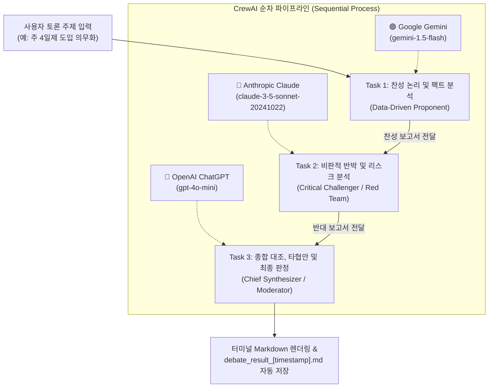

# 🏛️ Multi-Agent AI Debate & Synthesis CLI

Google Gemini, Anthropic Claude, OpenAI ChatGPT 3개 대표 최신 파운데이션 모델이 협업하는 **멀티 에이전트 찬반 토론 및 종합 판정 CLI 프로그램**입니다.

---

## 🌟 시스템 아키텍처 및 역할



| 에이전트 | 담당 모델 | 주 역할 및 목표 |
| :--- | :--- | :--- |
| **Agent 1: Data-Driven Proponent** | `gemini/gemini-1.5-flash` | 최신 데이터, 통계 지표, 기대 효과를 중심으로 강력한 찬성 논리 수립 |
| **Agent 2: Critical Challenger** | `anthropic/claude-3-5-sonnet-20241022` | 찬성 주장의 맹점, 예상 부작용, 비용/법적 리스크 등을 집요하게 파고드는 레드팀 반대 논리 수립 |
| **Agent 3: Chief Synthesizer** | `openai/gpt-4o-mini` | 양측 논리를 가치중립적으로 대조 및 오류 검증, 실행 가능한 타협안 및 최종 판정 보고서 작성 |

---

## 🚀 빠른 시작 가이드 (Quick Start)

### 1. 가상환경 생성 및 활성화
```bash
# 가상환경 생성 (Python 3.10+ 권장)
python -m venv .venv

# 가상환경 활성화 (Windows PowerShell)
.venv\Scripts\Activate.ps1

# (참고) macOS / Linux의 경우:
# source .venv/bin/activate
```

### 2. 의존성 패키지 설치
```bash
pip install -r requirements.txt
```

### 3. API 키 설정 (`.env`)
`.env` 파일에 각 AI 서비스의 API 키를 입력합니다:
```ini
# Google AI Studio (Gemini) API Key
GOOGLE_API_KEY=AIzaSy...

# Anthropic (Claude) API Key
ANTHROPIC_API_KEY=sk-ant-...

# OpenAI (ChatGPT) API Key
OPENAI_API_KEY=sk-proj-...
```

### 4. 프로그램 실행
```bash
python main.py
```

---

## 📋 기능 특징

1. **실시간 터미널 UI (Rich):** 
   - 모델별 상태 및 API 키 로드 점검 테이블 제공.
   - 각 에이전트의 진행 상태 및 최종 판정 보고서를 미려한 Markdown 형식으로 출력.
2. **토론 결과 자동 저장:** 
   - 토론이 완료되면 `debate_result_YYYYMMDD_HHMMSS.md` 파일로 전체 판정 보고서가 자동 저장됩니다.
3. **독립적 멀티 LLM 체계:**
   - CrewAI의 표준 `LLM` 클래스를 통해 Gemini, Claude, OpenAI를 동시에 유기적으로 연결.
